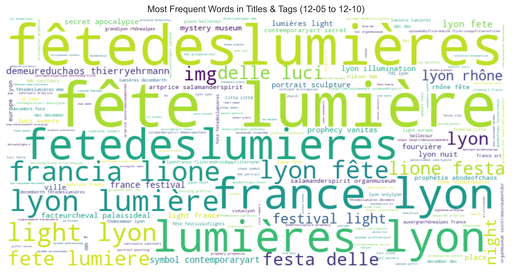

# Data Mining - Identifying Touristic Hotspots in Lyon

This project leverages data mining techniques to identify and analyze touristic
hotspots in Lyon. The analysis covers multiple steps, including data cleaning,
exploratory data analysis, clustering, text mining, and a Traveling Salesman
Problem (TSP) algorithm to optimize a tour of key locations.

To fully explore the analysis and visualizations, open and run the provided
Jupyter Notebook (`notebooks/touristic-hotspot-lyon.ipynb`). It contains
step-by-step explanations and interactive maps that allow for a deeper
understanding of the results.

---

## 1. Prerequisites

Ensure you have the following Python libraries installed before running the
notebook:

```bash
pip install numpy pandas scikit-learn scipy plotly matplotlib seaborn folium nltk networkx geopy wordcloud
```

Alternatively, all dependencies are listed and installed at the beginning of the
notebook.

---

## 2. Data Cleaning & Preprocessing

The dataset is preprocessed by:

-   **Removing unnecessary columns** that do not contribute to the analysis.
-   **Correcting date formats** to ensure proper time-based analysis.
-   **Filtering geographic coordinates** to **focus on Lyon**, removing outliers
    and irrelevant data.
-   **Saving the cleaned dataset** for further analysis.

---

## 3. Descriptive Analysis

To better understand the dataset, we perform an **initial statistical
exploration**:

-   **Photos per Year** → A histogram to visualize the number of photos taken
    annually.
-   **Photos per Month** → A histogram showing the distribution of photos
    throughout the year.
-   and more...


 These insights help detectrecurring
events, trends, and anomalies in the dataset.

---

## 4. Clustering Analysis

We apply three different clustering techniques to identify **touristic
hotspots** in Lyon:

### K-Means Clustering

-   Groups photos based on geographic coordinates.
-   Assigns every point to a cluster, but results in **large, less interpretable
    clusters**. 

### Hierarchical Clustering

-   Creates a hierarchical structure of clusters.
-   More interpretable but **less efficient for large datasets**.
    

### DBSCAN Clustering (Final Choice)

-   Detects **natural clusters** while ignoring noise points.
-   Provides **highly precise hotspots** for points of interest.
-   **We keep DBSCAN for further analysis** as it delivers the most meaningful
    results.
-   **Sampling (10% of points)** is used to improve computational efficiency.
     

---

## 5. Text Mining - Extracting Meaning from Titles & Tags

Since each photo contains textual metadata (**titles, tags**), we apply
**Natural Language Processing (NLP)** techniques to extract meaningful cluster
labels:

-   **Cleaning & Lemmatization** → Removing common words (e.g., "photo",
    "city"), applying NLP preprocessing.
-   **TF-IDF Analysis** → Extracting the most representative words for each
    cluster.
-   **Word Cloud Generation** → Visualizing the most frequent words in the
    dataset.
-   **Assigning Cluster Labels** → Each hotspot is named based on **recurring
    terms** in its associated photos. 

**Result**: We obtain **highly relevant cluster names**, which are displayed on
the interactive map. 

---

## 6. Temporal Analysis - Understanding Events Over Time

After noticing a **high density of photos taken between December 5-10 each
year**, we:

-   **Analyze frequent words in this period** → Detecting potential events.
-   **Generate a Heatmap** → Showing the locations with the highest activity.
-   **Findings**: This period corresponds to the **Fête des Lumières** in Lyon.

 

To generalize this approach, we extend it to **any date range** → allowing users
to input a timeframe and discover **relevant events and activities**.

---

## 7. Optimized Tourist Path - Traveling Salesman Problem (TSP)

To assist visitors in planning their trip, we implement a **TSP algorithm** to
determine the **shortest route** between **key points of interest** in **Lyon’s
Presqu’île**.

-   **Distance Matrix Calculation** → Computes the shortest path between
    clusters.
-   **TSP Solver** → Finds the **optimal tour** using heuristic or brute-force
    methods.
-   **Interactive Map** → Displays the recommended **optimal itinerary**.

This allows tourists to efficiently **visit multiple hotspots** in the most
**time-effective way**. 

---

## 8. Conclusion & Future Applications

This project successfully **identified and analyzed touristic hotspots in Lyon**
using a combination of **spatial clustering, text mining, and route
optimization**.

-   The approach **effectively detects events, places of interest, and tourist
    activity patterns**.
-   **Applying this method to other cities** could provide **valuable insights
    for travelers and urban planners**.
-   Future improvements could include **real-time data integration** or the
    addition of **user-generated insights** to refine recommendations.

By applying the same methodology to different locations, this **data-driven
approach** could be used to **discover attractions before visiting any new
city**.
